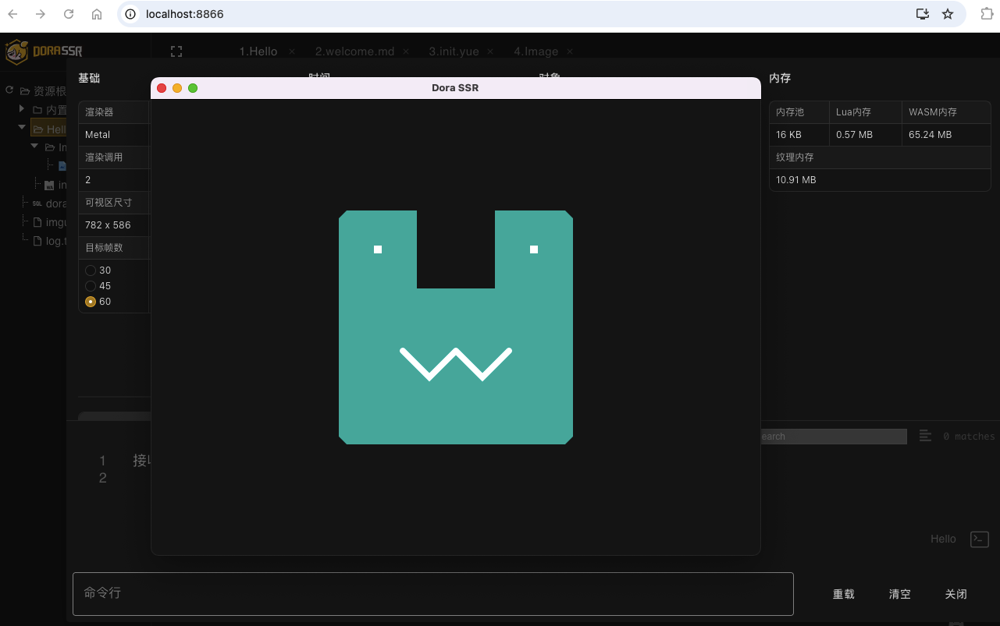
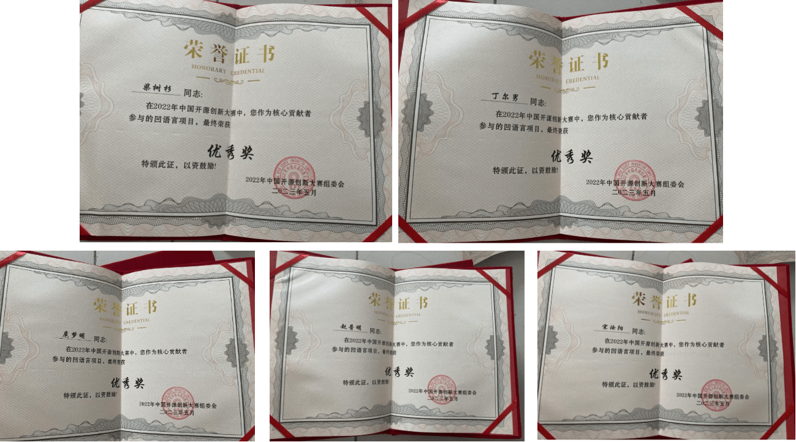

# 荣誉墙

### 2025：Dora SSR游戏引擎支持凹语言([#H20250112](#H20250112))

::: tip [https://wa-lang.org/smalltalk/st0067.html](https://wa-lang.org/smalltalk/st0067.html)

:::

### 2025：凹语言入选《国产编程语言蓝皮书-2024》([#H20250107](#H20250107))

::: tip [https://cdn-static.gitcode.com/doc/CNPL-2024-CHS.pdf](https://cdn-static.gitcode.com/doc/CNPL-2024-CHS.pdf)

:::

### 2024：凹语言跻身PLDB排行榜前200名([#H20241219](#H20241219))

::: tip [https://wa-lang.org/smalltalk/st0065.html](https://wa-lang.org/smalltalk/st0065.html)

:::

### 2024：凹语言获 2024 上海数智融合开源技术应用创新竞赛一等奖([#H20241213](#H20241213))

::: tip 凹语言核心团队成员「扈梦明」获得 2024 上海数智融合开源技术应用创新竞赛一等奖

:::

### 2024：凹语言获“GitCode年度十大开源人物”([#H20241024](#H20241024))

::: tip [凹语言联合发起人「丁尔男」获“GitCode年度十大开源人物”](https://mp.weixin.qq.com/s/ErmxRS4u7bL--vsgC2ZPqw)

:::

::: tip 凹语言入选“GitCode首发开源全景图”

:::

::: tip 凹语言首批入选“G-Star项目”

:::

### 2024：文汇报刊登凹语言专题([#H20240831](#H20240831))

::: tip [凹语言联合发起人「柴树杉」获“上海·智慧工匠提名”被文汇报专题报道](https://dzb.whb.cn/imgPath/2024-08-29/40829.pdf)

:::

### 2024：凹语言入选 “Gitee GVP 项目”([#H20240701](#H20240701))

::: tip [凹语言入选 Gitee GVP 最有价值的开源项目](https://wa-lang.org/smalltalk/st0043.html)

:::

### 2024：凹语言入选《国产编程语言蓝皮书-2023》([#H20240218](#H20240218))

::: tip [https://www.ploc.org.cn/ploc/CNPL-2023.pdf](https://www.ploc.org.cn/ploc/CNPL-2023.pdf)

:::

### 2023：凹语言获2023上海城市数字化转型信创（开源）应用竞赛一等奖([#H20231107](#H20231107))

::: tip 凹语言联合发起人「柴树杉」获2023上海城市数字化转型信创（开源）应用竞赛一等奖

:::

### 2023：凹语言获“OSCAR尖峰开源人物”([#H20230921](#H20230921))

::: tip 项目联合发起人之一「柴树杉」获得“[2023 OSCAR 尖峰开源人物](https://mp.weixin.qq.com/s/xm6jiy7cRGlgHD9e8vzOuQ)”。

:::

### 2023：凹语言入选 CNCF WASM 全景图([#H20230914](#H20230914))

::: tip [https://wa-lang.org/smalltalk/st0033.html](https://wa-lang.org/smalltalk/st0033.html)

:::

### 2023：凹语言获2022中国开源创新大赛优秀项目([#H20230309](#H20230309))

::: tip [https://wa-lang.org/smalltalk/st0023.html](https://wa-lang.org/smalltalk/st0023.html)

开发团队获得的证书：

:::

### 2022：凹语言获InfoQ 2022开发者最喜爱十大开源项目([#H20221231](#H20221231))

::: tip [凹语言参与 InfoQ 2022 新锐开源项目评选，获得了开发者最喜爱的项目的第4名](https://wa-lang.org/smalltalk/st0017.html)

:::

