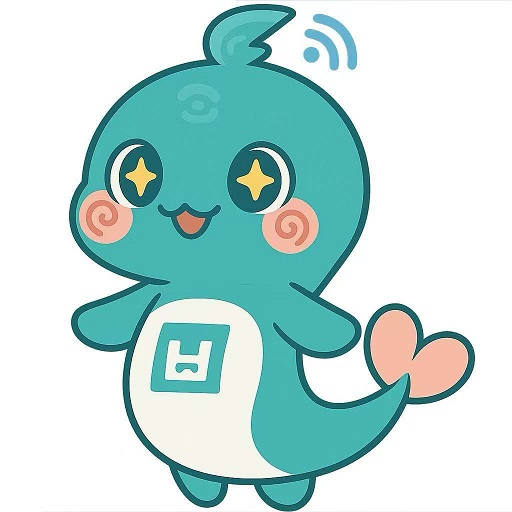
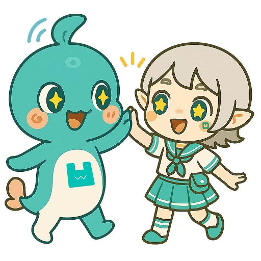
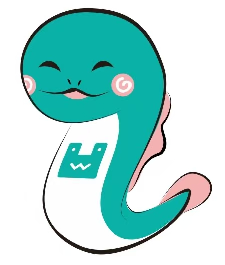

# 凹语言吉祥物——鲵凹凹

鲵凹凹是凹语言的第一个吉祥物，诞生时间大约在2022年的11月。鲵凹凹名字是从凹的谐音——娃娃鱼——而来，而娃娃鱼的学名大鲵。因为大鲵会发出婴儿般的啼哭声，因此得名“娃娃鱼”。

在2025年初，凹语言社区同学设计了[WA酱吉祥物](https://wa-lang.org/smalltalk/st0069.html)。这是他们的互动照片：

鲵凹凹在2022年第一次出境的形象：

B站视频: [https://www.bilibili.com/video/BV1Ks4y1H7SM/](https://www.bilibili.com/video/BV1Ks4y1H7SM/)
